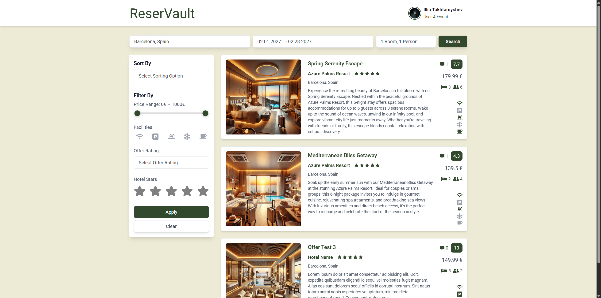

# ReserVault

## Project Scope and Objectives

### Introduction
**ReserVault** is a high-performance, full-stack hotel reservation platform. It combines a robust **Spring Boot** backend with a modern, responsive **React.js** frontend styled using **Tailwind CSS**, and features secure authentication with **JWT** and **OAuth2**, cloud integrations with **Cloudinary**, and scalable data management using **MongoDB Atlas**.

This project is not just a booking site — it’s a comprehensive platform that supports multiple user roles (User, Manager, Admin) and complex real-world flows like offer creation, hotel management, booking lifecycle with payment simulation, and embedded review systems. Every layer of the application is carefully designed for **clean code**, **modularity**, **security**, and **scalability**.

From a technical perspective, **ReserVault** demonstrates:
- A secure backend architecture using **Spring Security**, **JWT**, **OAuth2**, and layered service/repository logic.
- A RESTful API designed with **DTOs**, **exception handling**, and **role-based access control (RBAC)**.
- Fast frontend built using **Vite**, **React Query**, **React Router**, and **Tailwind CSS**, offering a smooth, reactive user experience.
- Full cloud integrations using **MongoDB Atlas** for database management and **Cloudinary** for image uploads.

---

### Core Functionalities:
- **Full Authentication Suite:**
  - Email/password registration and login.
  - Google OAuth2 integration.
  - Secure, stateless JWT-based sessions.

- **User Operations:**
  - Browse hotel offers and search with a bunch of filters.
  - Book offers, simulate payments, view booking history.
  - Manage profile, leave reviews.

- **Manager Operations:**
  - Create/edit/delete offers for hotels.
  - Respond to user reviews and manage offer availability.

- **Admin Control:**
  - Create/edit/delete hotels.
  - Manage users, and hotel-manager relationships.

- **Booking & Payment Logic:**
  - Book offers with real-time availability checks.
  - Simulated payment flow with expiry countdown.
  - Embedded payment and status tracking per booking.

- **Cloud & Performance:**
  - Image uploads handled via Cloudinary.
  - Optimized frontend rendering using Vite, React Query, and Tailwind.
  - Efficient backend query patterns with embedded MongoDB documents.

--- 

### Target Audience:
- **Frequent Travelers & Tourists** – who want an easy way to discover and book hotels with real-time availability and authentic reviews. 
- **Hotel Owners & Managers** – looking to promote their hotels and manage offers, availability, and guest feedback via a secure management dashboard.

--- 

### Success Criteria: 
- **Security First**:
  - JWT and OAuth2 integrated with Spring Security.
  - Role-based access with strict authorization across all endpoints.

- **Modular & Maintainable Codebase**:
  - Separation of concerns (Controllers → Services → Repositories).
  - DTO usage, validation layers, and centralized exception handling.

- **Production-Ready Architecture**:
  - Scalable NoSQL design with embedded MongoDB documents.
  - Cloud-based image and data storage via Cloudinary & MongoDB Atlas.

- **User Experience Excellence**:
  - Intuitive UI with fast load times.
  - Clear navigation paths for users, managers, and admins.

- **Business Logic Depth**:
  - Real-world workflows: manager verification, booking timeouts, review responses.
  - Embedded structures for offers, reviews, and payment details.

## Table of Contents

- [Project Scope and Objectives](#project-scope-and-objectives)
  - [Introduction](#introduction)
  - [Core Functionalities](#core-functionalities)
  - [Target Audience](#target-audience)
  - [Success Criteria](#success-criteria)

- **[Video Demo](#video-demo)**

- [Functional Requirements](#functional-requirements)
  - [Unauthenticated User Functionalities](#unauthenticated-user-functionalities)
  - [Authenticated User Functionalities](#authenticated-user-functionalities)
  - [Authenticated Manager User Functionalities](#authenticated-manager-user-functionalities)
  - [Authenticated Administrator User Functionalities](#authenticated-administrator-user-functionalities)

- [Non-Functional Requirements](#non-functional-requirements)

- [Tech Stack Selection](#tech-stack-selection)
  - [Backend](#backend)
  - [Frontend](#frontend)
  - [Tools & DevOps](#tools--devops)

- [Application Architecture](#application-architecture)

- [Database Layer](#database-layer)
  - [Overview](#overview)
  - [Quality Description](#quality-description)
  - [Entities](#entities)
  - [Entity Relationship Diagram (ERD)](#entity-relationship-diagram-erd)
  - [Relations Described](#relations-described)

- [Backend Layer](#backend-layer)
  - [Overview](#overview-1)
  - [Quality Description](#quality-description-1)
  - [Spring Boot Dependencies](#spring-boot-dependencies)
  - [Backend Structure](#backend-structure)
  - [Endpoints](#endpoints)

- [Frontend Layer](#frontend-layer)
  - [Overview](#overview-2)
  - [Quality Description](#quality-description-2)
  - [React Dependencies](#react-dependencies)
  - [Frontend Structure](#frontend-structure)
  - [React Router Route List](#react-router-route-list)

- [Cloud Service Layer](#cloud-service-layer)
  - [Overview](#overview-3)
  - [Quality Description](#quality-description-3)
  - [Quantity Description](#quantity-description)

- [Installation](#installation)
  - [Prerequisites](#prerequisites)
  - [Directory Structure](#directory-structure)
  - [Environment Variables](#environment-variables)
  - [Seeder and Cleanup Configuration](#seeder-and-cleanup-configuration)
  - [Backend Installation](#backend-installation)
  - [Frontend Installation](#frontend-installation)
  - [Application Startup Instructions](#application-startup-instructions)

- [Implementation Plan](#implementation-plan)

- **[Screenshots](#screenshots)**
  - [Public Interface](#public-interface)
  - [Administrator Interface](#administrator-interface)
  - [Manager Interface](#manager-interface)
  - [User Interface](#user-interface)

## Video Demo

### **[Watch ReserVault Demo](https://youtu.be/H-qt5pSy0zM?si=okGJI4wvmmdnKG6G)**

[](https://youtu.be/H-qt5pSy0zM?si=okGJI4wvmmdnKG6G)

### What’s Covered in the Video:

The video demonstration provides a structured walkthrough of the platform’s primary workflows and features across all roles — Administrator, Manager and User.

#### Authentication & Navigation
- Welcome screen with access to login and registration
- Registration using email/password and Google OAuth2
- Role-based dashboard routing after successful login
- JWT-based session handling and secure logout flow

#### Administrator features
- Admin dashboard with system data overview
- Full CRUD operations on hotel entities, including image management
- User list access, account deletion, and detail inspection
- Manager approval and rejection workflows
- Editing manager-hotel relationships
- Admin profile and security settings management

#### Manager features
- Manager dashboard with role-specific metrics
- Offer creation for assigned hotels with Cloudinary image uploads
- Editing existing offers: content, media, and pricing
- Viewing offer details, availability, and customer reviews
- Responding to user reviews directly within the platform
- Managing list of hotels assigned to the manager
- Profile updates and security management

#### User features
- Offer search using filters (location, facilities, price, availability)
- Offer detail view with images, facilities, reviews, and availability
- Booking flow with real-time availability and simulated payment logic
- Viewing and managing personal bookings and payment status
- Submitting and deleting reviews for offers
- Profile management: updating name, changing password, account deletion

## Functional Requirements

### Unauthenticated User Functionalities
* Open welcome page  
* Login using sign-in page  
* Register using sign-up page  


---

### Authenticated User Functionalities
* Open dashboard  
* Use smart search for searching offers  
* See offers information  
* Use sorting options for search  
* Use filtering options for search
* See hotel detailed information  
* See offer detailed information  
* See all of the images of each hotel  
* See all of the images of each offer  
* See available dates of each offer to be booked  
* Book offer within available dates, see total price to be paid  
* Leave reviews for offers  
* Delete reviews for offers  
* Change user name  
* Change password  
* Delete account  
* See bookings list  
* Simulate payment for booking  
* Cancel booking  
* Logout  


---

### Authenticated Manager User Functionalities
* Open dashboard, see statistics data for managers  
* Change user name  
* Change password  
* Delete account  
* Manage list of hotels with which manager works  
* See list of offers which were made by manager  
* See information of offers which were made by manager  
* See hotel detailed information  
* See offer detailed information  
* Leave review responses for offers made by manager  
* Delete review responses for offers made by manager  
* Modify offers made by manager  
  * Change all of the fields  
  * Change images order  
  * Upload new images  
* Create new offers for hotels with which manager works  
  * Choose hotel by identifier  
  * Change all of the fields  
  * Upload images  
* Logout  


---

### Authenticated Administrator User Functionalities
* Open dashboard, see statistics data for administrators  
* Change user name  
* Change password  
* See list of hotels  
* See information of hotels  
* Modify hotels  
  * Change all of the fields  
  * Change images order  
  * Upload new images  
* Create new hotels  
  * Change all of the fields  
  * Upload images  
* See list of users  
* See information of users  
* Delete users  
* Approve managers  
* Approve hotel lists with which each manager works  
* Edit hotel lists with which each manager works  
* Logout 


## Non-Functional Requirements

### Performance
The application must provide fast response times to ensure smooth user interactions, even under high load and concurrent usage.

### Scalability
The system must handle increasing volumes of users, hotels, offers, and bookings without significant performance degradation. Architecture is designed to support horizontal scaling and efficient resource management.

### Security
Sensitive data must be protected, and the system must guard against common web vulnerabilities.
* Utilizes Spring Security with JWT and OAuth2 authentication.
* All inputs are validated to prevent XSS, CSRF, and injection attacks.
* Passwords are hashed securely before storage.
* Role-based access control (RBAC) restricts actions by user roles.

### Availability
The system must maintain high availability with minimal downtime.
* Designed for deployment in cloud environments.
* Health checks and graceful error handling are implemented in the backend.

### Maintainability
The codebase must be clear, well-structured, and easy to update or debug.
* Modular architecture using services, controllers, and repositories.
* Follows clean code principles.
* Full Git-based version control and collaboration workflow.

### Usability
The user interface must be intuitive for all roles (users, managers, admins).
* Responsive design implemented using Tailwind CSS.
* Consistent navigation patterns and user feedback.

### Reliability
The system must operate correctly under expected conditions and recover gracefully from failures.
* Strong input validation and clear error messages.
* Built-in fallback behaviors and fault-tolerant service design.

### Auditability
User actions and system-level changes should be traceable for the purpose of moderation, debugging, or compliance tracking.

### Extensibility
The platform must allow for easy integration of new features without disrupting existing functionality.
* Follows open, modular design practices to support future enhancements. 

## Tech Stack Selection

### Backend

#### Spring Boot  
Spring Boot is the foundation of ReserVault's backend. It simplifies backend development with production-ready defaults and robust support for building RESTful APIs. Its modular structure allows clean separation of concerns, while integration with **Spring Data MongoDB** ensures seamless interaction with the cloud-hosted **MongoDB Atlas** database.

#### Spring Security + OAuth2  
Spring Security powers the authentication and authorization system. It supports:
- Standard login with email/password.
- OAuth2 login via Google.

It includes built-in protection against common vulnerabilities and enforces **role-based access control (RBAC)** for Admins, Managers, and Users.

#### JWT (JSON Web Tokens)  
JWT is used to implement **stateless authentication** across the system. Tokens are issued upon successful login and are included in subsequent API requests, eliminating the need for server-side session storage. This ensures scalable and secure session handling.

#### MongoDB Atlas  
ReserVault uses **MongoDB Atlas** as its NoSQL database. With its flexible document model, MongoDB enables dynamic schemas and efficient handling of embedded data. It also supports high-speed reads and is cloud-scalable.

#### Cloudinary API  
Cloudinary is integrated for media storage and delivery. It handles:
- Uploading hotel and offer images.
- Image transformation and optimization.

---

### Frontend

#### React.js  
React.js is the core framework for building ReserVault’s user interface. Its component-based architecture allows for modular, reusable, and maintainable UI code. **React Hooks** are used to manage state and side effects, while the virtual DOM provides efficient rendering.

#### Vite  
Vite serves as the build tool for the frontend. It offers:
- Lightning-fast development server.
- Hot Module Replacement (HMR) for real-time updates.
- Optimized build output for production.

This greatly enhances development speed and performance.

#### Tailwind CSS  
Tailwind CSS is used for **utility-first styling**, allowing developers to style components directly in markup. It enables:
- Rapid UI development.
- Consistent design patterns.
- Full responsiveness with minimal custom CSS.

#### React Router  
React Router manages **client-side routing**. It handles page navigation within the single-page app, dynamically rendering components based on the URL, creating a seamless and fast user experience without full page reloads.

#### React Query  
React Query handles **asynchronous data fetching**, caching, and synchronization. It improves frontend performance and reliability by ensuring that data like hotel offers and bookings remain up-to-date and consistent across the app.

---

### Tools & DevOps

#### Git & GitHub  
Git is used for **version control** throughout the development lifecycle. GitHub hosts the project repository, supporting version history tracking.

#### Postman  
Postman is used to test and document **REST API endpoints**. It helps ensure correct request/response flows between frontend and backend during development, and supports debugging and validation of complex API interactions.

#### MongoDB Atlas  
MongoDB Atlas serves as the **cloud-hosted MongoDB dashboard**, allowing:
- Easy database monitoring.
- Secure access control.
- Scalable, real-time management of collections and documents used in the application.

#### Cloudinary Dashboard  
Cloudinary’s dashboard provides **media management tools** for hotel and offer images. Features include:
- Upload tracking.
- On-the-fly image transformations.

## Application Architecture


### 1. Database (MongoDB Atlas)
**Component:** MongoDB (hosted via MongoDB Atlas)  
**Functionality:**  
MongoDB serves as the primary database. Its flexible document-based data model is ideal for the dynamic structure of users, hotels, offers, bookings, and embedded sub-documents such as reviews and payments.

**Data Flow:**  
* **Spring Data MongoDB** handles all read/write operations to the database, including:
  * User data
  * Hotel and offer details
  * Bookings and payment information
  * Embedded documents (e.g. reviews, facilities)

---

### 2. Backend (Spring Boot)
**Components:**  
Spring Boot, Spring Security, Spring Data MongoDB, JWT, OAuth2, Cloudinary API, Apache Tika

**Functionality:**  
The backend is the core of the application, responsible for:
* Business logic and role-based features (User, Manager, Admin)
* Secure RESTful APIs for authentication, booking, hotel/offer management, and reviews
* JWT-based session handling
* Google OAuth2 integration for third-party login
* File handling with Apache Tika (MIME type validation)
* Cloudinary integration for media storage and retrieval

**Data Flow:**  
* **HTTP (REST API):** Exposes secure endpoints consumed by the React frontend.
* **JWT:** Tokens are issued upon successful login and included in each subsequent request.
* **MongoDB:** Spring Data is used for all database operations across domain entities.
* **Cloudinary API:** The backend handles file uploads and returns image URLs for frontend use.

---

### 3. Frontend (React.js + Vite)
**Components:**  
React with Vite, Tailwind CSS, Axios, React Query

**Functionality:**  
The frontend renders the user interface and manages all client-side interactions. It is built as a single-page application (SPA) with the following capabilities:
* Component-based structure using React
* Responsive design using Tailwind CSS
* Secure and asynchronous API communication via Axios
* Efficient data fetching and caching using React Query

**Data Flow:**  
* **Axios:** Sends authenticated HTTP requests to backend endpoints with JWT headers.
* **GeoNames API:** Powers location-based autocomplete for search filtering.
* **Cloudinary (indirect):** Image URLs returned by the backend are displayed directly in UI components such as offer cards and hotel galleries.

---

### 4. Cloud Services (Cloudinary)
**Component:** Cloudinary

**Functionality:**  
Cloudinary handles media management for hotel and offer images. It supports secure uploads, transformation, optimization, and CDN-based delivery.

**Data Flow:**  
* **Backend Upload:** Images are uploaded from the backend using secure API credentials.
* **Frontend Usage:** Cloudinary returns optimized image URLs, which are then rendered in the UI without exposing storage credentials.

## Database Layer

### Overview
The Database Layer in ReserVault is built on top of **MongoDB Atlas**, a flexible and scalable NoSQL cloud database. It is responsible for storing and managing all core application data, including users, hotels, offers, bookings, and embedded documents such as reviews, payments, and facilities.

MongoDB’s document-oriented design enables denormalized data storage, allowing for high-performance reads and fast query access patterns — especially for deeply nested data like offers with embedded reviews. Hosted in the cloud, MongoDB Atlas ensures **high availability**, **auto-scaling**, and **robust security** for production-grade applications.

---

### Quality Description
* **MongoDB Atlas** is a schema-less, document-based NoSQL database that supports ReserVault’s evolving data model and domain-driven structure.
* Collections are modeled to reflect real-world relationships and optimize for efficient reads and writes.
* Embedded documents are used strategically to reduce joins and improve response times.

---

### Entities
* **User:**  
    * `id` (UUID, PK)  
    * `name`  
    * `email` (Unique)  
    * `password` 
    * `profile_image`  
    * `created_at`  
    * `verified` (for managers)   
    * `auth_provider` (Enum: `standard`, `google`) 
    * `roles` 

* **Role:**  
    * `id` (UUID, PK)  
    * `name`  

* **Hotel:**  
    * `id` (UUID, PK)  
    * `identifier`
    * `name`  
    * `description`  
    * `images_urls`
    * `stars`
    * `location` (Embedded Location Object)  
    * `created_at`  

* **Location (Embedded inside Hotel):**  
    * `country`  
    * `city` 
    * `street`
    * `postal_code`

* **HotelManager:**  
    * `id` (UUID, PK)  
    * `hotel_identifier` (Foreign Key, UUID) (Hotel assigned to the manager)  
    * `manager_id` (Foreign Key, UUID) (Manager handling the hotel)  
    * `status` (Enum: `pending`, `approved`)  
    * `created_at`  

* **Offer:**  
    * `id` (UUID, PK)
    * `hotel_manager_id` (Foreign Key, UUID) (Approved manager-hotel relationship)
    * `hotel_identifier` (Foreign Key, UUID) (Hotel to which offer belongs)  
    * `manager_id` (Foreign Key, UUID) (Manager who created the offer)  
    * `title`  
    * `description` 
    * `rating` 
    * `date_from`
    * `date_until`
    * `facilities` (Embedded Facilities Object)  
    * `room_count`
    * `people_count` 
    * `price_per_night`
    * `images_urls` 
    * `created_at`  
    * `reviews` (Embedded Array of Review Objects)  
    * `reviews` (Embedded Array of Review Objects) 
    
* **Facilities (Embedded Object inside Offer):**  
    * `wifi`
    * `parking`
    * `pool`
    * `air_conditioning`
    * `breakfast` 

* **Review (Embedded inside Offer):**   
    * `id` (UUID, PK)  
    * `user_id` (Foreign Key, UUID)
    * `title`
    * `comment`
    * `rating`
    * `created_at`  
    * `response` (Embedded ReviewResponse Object)  

* **ReviewResponse (Embedded inside Review):**
    * `manager_id` (Foreign Key, UUID)
    * `comment`
    * `created_at`  

* **Booking:**   
    * `id` (UUID, PK)  
    * `offer_id` (Foreign Key, UUID) (Offer being booked)  
    * `user_id` (Foreign Key, UUID) (User who booked)  
    * `date_from`
    * `date_until`
    * `status` (Enum: `pending`, `confirmed`, `canceled`)  
    * `expires_at`
    * `created_at`  
    * `payment` (Embedded Payment Object)  

* **Payment (Embedded inside Booking):**  
    * `status` (Enum: `pending`, `paid`, `failed`)  
    * `created_at`  

* **BookedDates:**  
    * `id` (UUID, PK)  
    * `offer_id` (Foreign Key, UUID) (Offer being booked)  
    * `date_from` (Date)  
    * `date_until` (Date) 

---

### Entity Relationship Diagram (ERD)


---

### Relations Described
* **Many-to-Many:**  
    * **Booking → Payment** A user can have multiple roles, and a role can belong to multiple users.  
    * **Booking → Payment** A hotel can have multiple managers, and a manager can manage multiple hotels. (via HotelManager)

* **One-to-Many:**  
    * **Hotel → Offers** A hotel can have multiple offers.  
    * **Manager → Offers (via HotelManager)** A manager can create multiple offers, but but offer belongs to one manager.
    * **Offer → BookedDates** An offer can have multiple booked dates, but booked date belongs to one offer.  
    * **User → Bookings** A user can make multiple bookings, but a booking is linked to one user.  
    * **Offer → Bookings** An offer can have multiple bookings, but each booking is for one offer.  
    * **User → Reviews** A user can write multiple reviews, each linked to a specific offer.  
    * **Manager → ReviewResponses** A manager can respond to multiple reviews, each through a ReviewResponse embedded in a review.  

* **One-to-one:**  
    * **Booking → BookedDates** Each booking creates one booked dates. 

* **Embedded Relationships (Denormalization for Faster Reads):**  
    * **Booking → Payment** (Each Booking **embeds** its Payment for fast retrieval).  
    * **Offer → Reviews** (Each Offer **embeds** its Reviews to avoid extra queries).  
    * **Review → ReviewResponse** (Each Review **embeds** a single Manager Response).  
    * **Hotel → Location** (Each Hotel **embeds** a Location object).  
    * **Offer → Facilities** (Each Offer **embeds** a Facilities object describing available amenities).  

## Backend Layer

### Overview
The backend layer of ReserVault serves as the backbone of the entire application architecture. Built using **Spring Boot**, this layer enables secure, efficient communication between the React frontend and the MongoDB Atlas database. It manages business logic for user authentication, role-based access control, hotel and offer operations, review management, and bookings.

The backend is modular, maintainable, and scalable — built with modern Spring technologies, RESTful design principles, and robust integration with third-party services like Cloudinary.

---

### Quality Description

* **Spring Boot Framework:** Simplifies development with annotation-driven configuration, dependency injection, and modular service layers that support clean separation of concerns and testability.

* **Role-Based Access Control (RBAC):** Implements strict access management for three roles—User, Manager, and Admin — ensuring that each user only accesses allowed functionality.

* **Efficient Data Handling:** Uses MongoDB Atlas to store denormalized and embedded documents, enabling faster read operations without costly joins.

* **RESTful API Design:** Clean, versionable endpoints are organized across multiple controllers based on domain, following REST principles and HTTP standards.

* **Image Management:** Cloudinary is used to handle image uploads, optimizations, and transformations for hotels and offers.

* **Validation and Error Handling:** Uses Spring validation mechanisms and centralized exception handling to return meaningful, consistent error messages.

* **Stateless Communication:** All client-server interactions are stateless, secured using JWTs to authenticate and authorize every request.

---

### Spring Boot Dependencies

* `spring-boot-starter-web`: Core Spring MVC dependency for building REST APIs with controller support, JSON serialization, and HTTP request handling.

* `spring-boot-starter-security`: Provides authentication and authorization functionality; used alongside JWT and role-based access.

* `spring-boot-starter-oauth2-client`: Enables secure OAuth2 login integration (e.g., Google login).

* `spring-boot-starter-data-mongodb`: Integrates MongoDB using Spring Data repositories for seamless interaction with MongoDB Atlas.

* `jjwt-api`, `jjwt-impl`, `jjwt-jackson`: A set of libraries for implementing JWT authentication — used for signing, validating, and parsing JSON Web Tokens.

* `cloudinary-http44`: HTTP-based integration with Cloudinary for uploading, transforming, and serving image files securely.

* `lombok`: Reduces boilerplate by generating constructors, getters, setters, and more via annotations at compile time.

* `tika-core`: Used to validate file MIME types during upload, improving security for image handling via Apache Tika.

---

### Backend Structure

* `config`: Global configurations such as CORS, Cloudinary setup, and cleanup job settings. Ensures centralized and consistent system behavior.

* `controllers`: REST controllers that define HTTP endpoints and route requests to corresponding service methods.

* `dto`: Data Transfer Objects used to structure request and response payloads, ensuring data consistency and abstraction from internal models.

* `models`: Core entity definitions including domain models and enums used throughout the system.

* `repositories`: Interfaces extending Spring Data MongoDB repositories to manage persistence and queries.

* `security`: Components for JWT token generation, OAuth2 login, request filtering, and overall Spring Security configuration.

* `services`: Business logic layer responsible for orchestrating operations across controllers, repositories, and utilities. This is where core application behavior is defined.


---

### Endpoints

### Authentication Controller - `AuthController`
* **POST** `/auth/register`  
    * Creates a new user with email, name, and password.
* **POST** `/auth/login`  
    * Logs in a user and returns a JWT token.
* **POST** `/auth/logout`  
    * Logs out the user.
* **GET** `/auth/me`  
    * Retrieves details of the logged-in user.
* **PUT** `/auth/me/password`  
    * Updates the user’s password.
* **GET** `/oauth2/login/google`  
    * Redirects the user to Google's OAuth2 authentication page.
    * **GET** `/oauth2/login/success`  
        * Handles successful OAuth2 authentication, issues JWT, and redirects to the frontend.
    * **GET** `/oauth2/login/failure`  
        * Handles failed OAuth2 authentication attempts.

---

### User Controller - `UserController`
* **GET** `/users/me`  
    * Retrieves the current user's profile.
* **PUT** `/users/me/name`   
    * Updates the user’s profile name.
* **DELETE** `/users/me`  
    * Deletes the authenticated user account.

---

### Admin Controller - `AdminController`
* **GET** `/admin/users`  
    * Retrieves a list of all users.
* **GET** `/admin/users/{id}`  
    * Retrieves details of a specific user.
* **DELETE** `/admin/users/{id}`  
    * Deletes a user.
* **PUT** `/admin/managers/{manager_id}/approve`  
    * Approves a manager request, allowing the user to create offers.
* **DELETE** `/admin/managers/{manager_id}/reject`  
    * Rejects manager request and deletes manager user. 
* **GET** `/admin/managers/{manager_id}/hotels`  
    * Gets hotels with which manager works.
* **GET** `/admin/hotels`  
    * Retrieves a list of all hotels.
* **POST** `/admin/hotels`  
    * Creates a new hotel.
* **PUT** `/admin/hotels/{id}`  
    * Updates hotel details.
* **DELETE** `/admin/hotels/{id}`  
    * Deletes a hotel.
* **DELETE** `/admin/hotels/{id}/images`  
    * Deletes a hotel image.

---

### Manager Controller - `ManagerController`
* **GET** `/manager/offers`  
    * Retrieves the list of offers created by manager.
* **GET** `/hotels`  
    * Retrieves the list of hotel identifiers for manager.
* **POST** `/manager/offers`  
    * Creates a new offer for a hotel.
* **DELETE** `/manager/offers/{id}`  
    * Deletes an offer.
* **PUT** `/manager/offers/{id}`  
    * Updates offer details.
* **POST** `/manager/reviews/{reviewId}/response`  
    * Allows a manager to respond to a review.

---

### Hotel Controller - `HotelController`
* **GET** `/hotels/{id}`  
    * Retrieves details of a specific hotel.
* **GET** `/hotels/autocomplete`  
    * Returns suggested locations based on user input.

---

### Offer Controller - `OfferController`
* **GET** `/offers`  
    * Retrieves a list of all available offers.
* **GET** `/offers/{id}`  
    * Retrieves details of a specific offer.
* **GET** `/offers/search`  
    * Searches for hotel offers based on filters.
* **GET** `/offers/{offerId}/booked-dates`  
    * Retrieves all booked dates for a specific offer.

---

### Booking Controller - `BookingController`
* **POST** `/bookings`  
    * Creates a new booking for an offer.
* **GET** `/bookings`  
    * Retrieves a list of bookings for the authenticated user.
* **GET** `/bookings/{id}`  
    * Retrieves details of a specific booking.
* **DELETE** `/bookings/{id}`  
    * Cancels a booking if it is still pending.
* **POST** `/bookings/{bookingId}/pay`  
    * Simulates a payment for a booking.
* **GET** `/bookings/{bookingId}/payment-status`   
    * Retrieves the payment status for a booking.

---

### Review Controller - `ReviewController`
* **POST** `/offers/{offerId}/reviews`  
    * Creates a review for an offer. (Authenticated users only)
* **GET** `/offers/{offerId}/reviews`  
    * Retrieves all reviews for a specific offer.

---

### Image Proxy Controller - `ImageProxyController`
* **GET** `/proxy/image`
    * Proxies an image request to an external URL.

## Frontend Layer

### Overview
The client-side of the ReserVault application is built using **React.js**, leveraging **Vite** for lightning-fast development builds and **Tailwind CSS** for utility-first styling. The application delivers a modern, clean, and responsive user interface across all device types.

ReserVault’s frontend architecture supports role-based interfaces (User, Manager, Admin) and integrates advanced UI libraries and state tools for optimal developer and user experience. Navigation is handled by **React Router**, data fetching and caching by **React Query**, and animations/transitions are enhanced via **Framer Motion** and **Fancybox**.

### Quality Description

* **React with Hooks:** Enables modular, declarative UI logic with efficient component-based design. Paired with **React Hook Form** for optimized form state management and validation.

* **Tailwind CSS:** Provides scalable and consistent styling across components, supporting responsive design and rapid UI development.

* **Vite:** Ensures fast development with hot module replacement and minimal configuration. Builds are optimized for performance and production-readiness.

* **React Router:** Handles client-side routing with support for nested routes and protected views, offering smooth transitions between pages.

* **React Query:** Manages server state, caching, and background updates, reducing API call redundancy and improving perceived performance.

* **Axios with Interceptors:** Used for API communication, automatically injecting JWT tokens and managing token expiration for secure requests.

* **Framer Motion and Fancybox:** Enhances user experience with interactive animations and responsive, full-screen image previews.

---

### React Dependencies

#### Core React and UI Framework
* **React** and **React DOM:** Core libraries for building reactive UIs with a component-driven approach.
* **React Router DOM:** Enables dynamic, client-side routing with support for nested and protected views.
* **Tailwind CSS:** Utility-first CSS framework used for building consistent and responsive interfaces.

#### State and Form Management
* **React Hook Form:** Provides declarative and performant form state handling with built-in validation.
* **@tanstack/react-query:** Handles asynchronous server state with caching, background syncing, and error handling.

#### Networking and API Integration
* **Axios:** Promise-based HTTP client used for secure API requests. Includes interceptors for JWT token injection and error handling.

#### UI Enhancements
* **Framer Motion:** Animation library used to add transitions, animations, and layout changes to components.
* **@fancyapps/ui (Fancybox):** Used to display full-screen image galleries with zoom, swipe, and lightbox support.

#### Icons
* **React Icons:** Integrates vector-based icons from multiple icon libraries directly into components.

#### Date and Range Handling
* **React Date Range:** Used for date selection in booking forms.
* **Date-fns:** Utility library for parsing, manipulating, and formatting dates.
* **React Range:** Slider component used for price range filtering.

#### Build Tools
* **Vite:** Ultra-fast dev server and build tool with support for modern features.
* **@vitejs/plugin-react-swc:** Plugin to compile React using the high-performance SWC compiler.
* **Autoprefixer and PostCSS:** Tools to automatically add vendor prefixes for cross-browser compatibility.
* **ESLint and Plugins:** Enforces code quality standards and ensures consistent coding practices.
* **@types/react and @types/react-dom:** TypeScript definitions for enhanced developer experience with type checking and autocomplete.

---

### Frontend Structure

* `api`: Axios configuration module used to interact with backend APIs.

* `assets`: Contains static assets such as the application logo.

* `components`: Contains reusable UI components organized by role or domain:
  * `admin`: UI components for admin hotel and user management.
  * `manager`: Components used by managers for managing offers.
  * `user`: Components for end-users including offer lists, booking displays.
  * `common`: Shared elements like buttons, modals, input fields, and layout wrappers.

* `context`: Hosts global provider `AuthContext` for authentication state and user roles.

* `pages`: Full route-level views grouped by feature or role:
  * `admin`: Pages for managing hotels and users.
  * `manager`: Pages for creating, editing, and managing hotel offers and responding to reviews.
  * `user`: Pages for browsing offers and managing bookings.
  * `auth`: Login and registration pages.
  * `common`: Shared pages such as dashboard, welcome screen, and profile page.

* `App.jsx`: Main component that defines the layout and application routing. Wraps the app with context providers and React Router.

* `main.jsx`: Entry point of the application. Initializes the React render process and sets up global providers.

* `App.css`, `index.css`: Global stylesheet files. Configure Tailwind's base styles, custom overrides, and global layout adjustments.


## React Router Route List

The frontend uses **React Router** for client-side routing. Below is a breakdown of all major routes, their corresponding components, description, and access control based on user roles.

### Public Routes

| Path        | Component     | Description                                                                 | Access       |
|-------------|---------------|-----------------------------------------------------------------------------|--------------|
| `/`         | WelcomePage   | Landing page with options to log in or register.                            | Public       |
| `/register` | Register      | Registration page supporting standard and Google OAuth2 options.            | Public       |
| `/login`    | Login         | Login page supporting standard and Google OAuth2 options.                   | Public       |

---

### Authenticated Routes

| Path               | Component     | Description                                                                                      | Access                            |
|--------------------|----------------|--------------------------------------------------------------------------------------------------|-----------------------------------|
| `/dashboard`       | Dashboard      | Main dashboard shown after login. Displays content based on user role.                          | Authenticated User/Manager/Admin  |
| `/profile`         | ProfilePage    | User profile view and settings page.                                                            | Authenticated User/Manager/Admin  |
| `/profile/:view`   | ProfilePage    | Conditional route to support profile detail view or editing modes using dynamic segments.      | Authenticated User/Manager/Admin                |

---

### Admin Routes

| Path                   | Component       | Description                                                                                      | Access |
|------------------------|-----------------|--------------------------------------------------------------------------------------------------|--------|
| `/admin/hotels`        | AdminHotels     | Admin panel to view, create, update, and delete hotels.                                          | Admin  |
| `/admin/hotels/:view`  | AdminHotels     | Conditional route to support hotels list view or creation modes using dynamic segments.                                            | Admin  |
| `/admin/users`         | AdminUsers      | Admin panel listing users and managers with available management actions.                        | Admin  |

---

### Manager Routes

| Path                          | Component        | Description                                                                                         | Access  |
|-------------------------------|------------------|-----------------------------------------------------------------------------------------------------|---------|
| `/manager/offers`             | ManagerOffers    | Manager panel to view, create, update, delete, and respond to reviews on offers.                   | Manager |
| `/manager/offers/:view`       | ManagerOffers    | Conditional route to support offers list view or creation modes using dynamic segments.                                    | Manager |

---

### User Routes

| Path               | Component            | Description                                                                                      | Access            |
|--------------------|----------------------|--------------------------------------------------------------------------------------------------|-------------------|
| `/offers/search`   | OfferSearchResults   | Displays offers based on search parameters (filters, location, etc).                             | Authenticated User |
| `/user/bookings`   | UserBookings         | Lists user bookings with current status, payment state, and action options.                      | Authenticated User |

## Cloud Service Layer

### Overview
ReserVault integrates **Cloudinary** as its media management and delivery service. It is used to handle image uploads for both hotels and offers, enabling a seamless, media-rich user experience. All uploads are performed via the backend, which interacts directly with Cloudinary's secure API.

After upload, **secure URLs** are generated and stored in the MongoDB database. These URLs are later consumed by the frontend to render optimized images within hotel listings, offer galleries, and detailed views.

---

### Quality Description

* **Reliability:**  
  Cloudinary provides a highly dependable and resilient media hosting service. Uploaded assets are served via persistent, secure URLs, ensuring consistent availability across the application.

* **Scalability:**  
  Cloudinary supports horizontal scaling by default. As ReserVault scales from a small deployment to a production-scale app with thousands of hotels and offers, Cloudinary’s autoscaling and global CDN ensure media performance and stability remain intact.

* **Security:**  
  All asset URLs are served over HTTPS, and access is restricted via Cloudinary’s built-in access control features. This prevents unauthorized modification or retrieval of media files.

---

### Quantity Description

* **Volume:**  
  The system is designed to support large volumes of image uploads. Each hotel or offer can include multiple high-resolution images, all of which are efficiently stored and retrieved using Cloudinary.

* **Performance:**  
  Cloudinary automatically optimizes images using transformation presets, compression, and responsive delivery techniques. With its integrated CDN, images load quickly on any device and from any geographic location.

* **Maintenance:**  
  Offloading media storage and processing to Cloudinary eliminates the need to manage local file systems, backups, or storage scaling. This allows developers to focus on core platform functionality instead of infrastructure concerns.

## Installation

This section outlines the necessary steps to configure the development environment for **ReserVault** and execute the application locally using the provided source code. It includes system prerequisites, environment variable configuration, seed data management, and project startup instructions.

---

### Prerequisites

#### Backend Requirements

- **Java Development Kit (JDK) 17 or later**  
  Required to build and run the Spring Boot backend.

- **Apache Maven 3.8 or later**  
  Used for project dependency management and building the backend application.

- **MongoDB Atlas Account**  
  Provides a cloud-hosted NoSQL database for storing user data, hotels, offers, bookings, and embedded documents.

- **Cloudinary Account**  
  Required for uploading, transforming, and serving images for hotels and offers via a global CDN.

- **Google Cloud Platform Account**  
  Needed to configure OAuth2 login. The application integrates Google authentication for secure third-party user sign-in.

#### Frontend
- **Node.js v18.18.0 or later**  
  Required to run the Vite development server and build the React-based frontend application.

- **npm v9.8.1 or later**  
  Used for managing frontend dependencies and running development scripts.

- **GeoNames API Account**  
  Required to enable the smart search feature on the frontend, which provides real-time location suggestions (countries and cities) during offer filtering.
  
---

### Directory Structure

The root directory contains two main subprojects:
- `reservault-backend`: Contains the Spring Boot backend application.
- `reservault-frontend`: Contains the Vite-powered React frontend.

---

### Environment Variables

Both backend and frontend applications depend on environment variables to handle secure authentication, database access, and third-party integrations.

#### `reservault-backend/.env`

**JWT Configuration**
- `JWT_SECRET`: Secret key used for signing and verifying JWT tokens.

**MongoDB Configuration**
- `MONGO_URI`: MongoDB Atlas connection string.
- `MONGO_DB_NAME`: Name of the MongoDB database used by the application.

**Google OAuth2 Configuration**
- `GOOGLE_CLIENT_ID`: Client ID for Google OAuth2 authentication.
- `GOOGLE_CLIENT_SECRET`: Client secret for Google OAuth2 authentication.

**Cloudinary Configuration**
- `CLOUDINARY_CLOUD_NAME`: Cloudinary cloud identifier.
- `CLOUDINARY_API_KEY`: Cloudinary API key.
- `CLOUDINARY_API_SECRET`: Cloudinary API secret key.

#### `reservault-frontend/.env`

- `VITE_API_BASE_URL`: Base URL for backend API requests (`http://localhost:8080` during local development).

#### `reservault-frontend/.env.local`

- `VITE_GEONAMES_USERNAME`: GeoNames API username used for location-based smart search suggestions.

---

### Seeder and Cleanup Configuration

ReserVault includes predefined seeders and cleanup utilities to facilitate development, testing, and demonstration workflows.

#### Seeder Configuration

Seeder classes are located under the `config/seeder` package. Seeder behavior is controlled through the `application.yml` configuration file under the `reservault.seeders` namespace. Execution is orchestrated by a central `MasterSeederConfig`.

**Included Seeder Modules:**
- `RoleSeederConfig`: Adds essential roles (`ROLE_USER`, `ROLE_MANAGER`, `ROLE_ADMIN`). **Must be enabled on first application start.**
- `AdminSeederConfig`: Creates a default administrator user (`admin@example.moc`). **Highly recommended for the first start of the app to access to the admin panel.**
- `ManagerSeederConfig`: Optionally inserts a sample manager account.
- `HotelSeederConfig`: Adds sample hotel entries for development use.
- `OfferSeederConfig`: Generates demo offers linked to the seeded hotels and manager account.

**Enabling Seeders:**
1. Set `reservault.seeders.enabled=true` in `application.yml` to activate the master seeder.
2. Enable or disable individual seeders using respective flags under `reservault.seeders.*`.
3. **After initial run, set `reservault.seeders.enabled=false` to prevent duplication.**

**Important Note:**

The `HotelSeederConfig` and `OfferSeederConfig` rely on static image assets for initial uploads to Cloudinary. These images must be placed in the following directories:

- `src/main/resources/static/hotels-images/`
- `src/main/resources/static/offers-images/`

Sample filenames used in seeders:
- `hotel1_img1.png`
- `hotel2_offer1_img1.png`

**These files are not included in the source code and must be supplied manually or replaced with placeholders matching expected filenames.**

---

#### Cleanup Utilities

Cleanup utilities are defined under the `config/cleanup` package and can be enabled via the configuration flag: `reservault.cleanup.enabled=true`.

**Included Cleanup Services:**
- `CloudinaryCleanupConfig`: Deletes all images associated with hotels and offers from the Cloudinary account.
- `DatabaseCleanupConfig`: Performs a complete data wipe of the MongoDB database.

**Usage Scenarios:**
- Resetting the development environment to a clean state.
- Preparing the system for production deployment.

---

### Backend Installation

1. Open a terminal and navigate to the backend directory:
   ```bash
   cd reservault-backend
   ```
2. Build and run the Spring Boot application:
   ```bash
   ./mvnw spring-boot:run
   ```
3. The backend server will be accessible at:
   ```
   http://localhost:8080
   ```

---

### Frontend Installation

1. Open a terminal and navigate to the frontend directory:
   ```bash
   cd reservault-frontend
   ```
2. Install frontend dependencies:
   ```bash
   npm install
   ```
3. Start the Vite development server:
   ```bash
   npm run dev
   ```
4. The frontend application will be available at:
   ```
   http://localhost:5173
   ```

---

### Application Startup Instructions

To run the application locally:

1. Start the backend server using Spring Boot.
2. Start the frontend development server using Vite.
3. Access the application via:
   ```
   http://localhost:5173
   ```

Following these steps will result in a fully functional local development instance of ReserVault with full backend and frontend capabilities.

## Implementation Plan

The following plan outlines the chronological implementation phases undertaken during the development of the ReserVault platform. Each phase covers both backend and frontend responsibilities and reflects the actual development workflow.

---

### 1. Initial Project Setup and User Authentication

#### Backend
- Initialize the Spring Boot project with Maven dependencies.
- Configure MongoDB Atlas connection.
- Set up Spring Security with JWT-based authentication.
- Implement user registration endpoint.
- Implement login functionality with JWT issuance.
- Implement logout mechanism.
- Create user profile retrieval endpoint.

#### Frontend
- Initialize the React project using Vite.
- Configure Tailwind CSS and React Router.
- Establish base folder structure and component organization.
- Create global authentication context.
- Implement welcome page with registration and login access.
- Build registration and login forms with client-side validation.

---

### 2. Google OAuth2 Integration

#### Backend
- Implement OAuth2 login flow using Google as the provider.

#### Frontend
- Integrate Google login using OAuth2 and handle JWT issuance upon success.

---

### 3. Hotel Entity and Listing Management (Administrator Role)

#### Backend
- Define and implement the Hotel entity.
- Integrate Cloudinary for hotel image upload and storage.
- Develop hotel service and repository layers.
- Implement hotel creation endpoint for administrators.
- Implement hotel listing endpoint.

#### Frontend
- Implement application header with role-based navigation.
- Build hotel management interface for administrators.
- Display a dynamic list of all hotels.

---

### 4. Hotel Editing (Administrator Role)

#### Backend
- Implement hotel update functionality via secured endpoints.

#### Frontend
- Develop hotel creation and editing interfaces.
- Enable administrators to upload, edit, and reorder images.

---

### 5. Manager Registration Workflow

#### Backend
- Implement manager registration request mechanism.
- Create `ManagerHotel` entity linking managers to hotels.
- Enable managers to request access by providing hotel identifiers.
- Mark manager accounts as pending until verified.

#### Frontend
- Implement manager registration interface.
- Display status message for pending verification requests.

---

### 6. User and Manager Management (Administrator Role)

#### Backend
- Implement user listing and detail endpoints for administrators.
- Implement manager approval and rejection workflows.

#### Frontend
- Build user management dashboard for administrators.
- Create interface for reviewing and approving manager requests.

---

### 7. Offer Management and Listing (Manager Role)

#### Backend
- Define Offer and Facilities entities.
- Implement embedded Review and ReviewResponse structures.
- Develop service layer for offer creation and retrieval.
- Implement offer creation endpoint for managers.
- Implement manager-specific offer listing.

#### Frontend
- Implement offer management dashboard for managers.
- Display existing offers with edit and delete functionality.

---

### 8. Offer Editing and Creation (Manager Role)

#### Backend
- Implement offer update endpoints with full field-level control.

#### Frontend
- Develop interfaces for offer creation and editing.
- Enable upload, ordering, and display of offer-related media.

---

### 9. Hotel and Offer Detail Pages

#### Frontend
- Implement detailed hotel view with full metadata and images.
- Implement detailed offer view with pricing, availability, and reviews.

---

### 10. User Profile and Account Management

#### Backend
- Implement endpoints for updating user profile information.
- Implement secure password change functionality.

#### Frontend
- Build user profile page with update capabilities.
- Implement password change flow with validation.

---

This implementation plan reflects the systematic development process behind ReserVault, ensuring high cohesion between frontend and backend features while adhering to role-based access control, domain-driven structure, and production-grade architecture.

## Screenshots

This section presents a curated collection of interface screenshots to demonstrate the visual design, user flows, and role-based functionality implemented in ReserVault. Each image highlights a specific feature or module relevant to a distinct user role: Administrator, Manager, or Standard User.

---

### Public Interface

#### Welcome Page
Displays the entry point of the application with navigation options for registration and login.  


#### Registration Page
Presents the user registration form with standard and Google OAuth2 login options.  


#### Login Page
Interface for user authentication using email/password or Google account.  


---

### Administrator Interface

#### Dashboard
Overview of administrative statistics and access to user and hotel management panels. 


#### Hotel Management — Listing View
Displays all hotels currently registered in the system with control options.  


#### Hotel Management — Edit View
Interface for updating existing hotel records and reordering images.  


#### Hotel Management — Create View
Form for registering a new hotel, including metadata and image uploads.  


#### User Management
Lists all registered users, including role assignment and manager verification tools.  


#### Manager-Hotel Assignment
Interface for editing the list of hotels assigned to each manager.  


#### Profile — Name Update
Admin personal information update screen.  


#### Profile — Security Settings
Interface for password update and security configuration.  


---

### Manager Interface

#### Dashboard
Displays key performance indicators and quick access to offer management.  


#### Offer Management — Listing View
Displays all offers managed by the currently logged-in manager.  


#### Offer Management — Edit View
Enables modification of existing offers, including pricing, images, and availability. 


#### Offer Management — Offer Details View  
Displays comprehensive details for a specific offer created by the manager, including pricing, facilities, availability, and image gallery. Allows to leave responses for reviews.


#### Offer Management — Hotel Details View  
Provides an overview of the associated hotel for a given offer, including location, star rating, and metadata.  


#### Offer Management — Create View
Form for creating new offers tied to approved hotels.  


#### Profile — Name Update
Manager profile name update screen.  


#### Profile — Security Settings
Interface for password change and account deletion.  


#### Profile — Hotel Assignment View
Displays the list of hotels currently assigned to the manager. 


---

### User Interface

#### Dashboard
Default landing page for authenticated users.  


#### Offer Search Results
Displays search results based on filters such as location, price, and facilities.  



#### Offer Search Results — Offer Details View  
Displays full information for a selected offer, including booking options, facilities, and user reviews. Allows to book the offer and leave a review.


#### Offer Search Results — Hotel Details View  
Provides detailed information about the hotel that hosts the selected offer, including images and descriptive content.  


#### Offer Search Results — Hotel Specific
Search results filtered by a specific hotel.  


#### Bookings Overview
Lists current and historical bookings with payment status and actions.  


#### Profile — Name Update
User profile information update screen.  


#### Profile — Security Settings
Password change and account deletion interface for user.  

